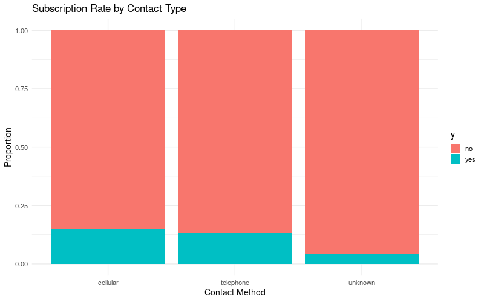

```{r appendix, include=FALSE}
library(readr)
library(knitr)
library(tidyverse)
library(boot)
library(glmnet)
library(caret)
library(pROC)
library(MASS)
library(ggplot2)

set.seed(445) 

bank_full <- read_delim("data/bank-full_1.csv", 
    delim = ";", escape_double = FALSE, trim_ws = TRUE)

bank_full$y <- factor(bank_full$y, levels = c("no", "yes"))


bank_full <- bank_full %>%
  mutate(
    job = as.factor(job),
    marital = as.factor(marital),
    education = as.factor(education),
    default = as.factor(default),
    housing = as.factor(housing),
    loan = as.factor(loan),
    contact = as.factor(contact),
    month = as.factor(month),
    poutcome = as.factor(poutcome)) %>% 
  mutate(previously_contacted = as.factor(ifelse(pdays == -1, "no", "yes")))

train_index <- createDataPartition(bank_full$y, p = 0.8, list = FALSE, times = 1)
train_data <- bank_full[train_index, ]
test_data  <- bank_full[-train_index, ]

cat(paste("Training set size:", nrow(train_data), "\n"))
cat(paste("Test set size:", nrow(test_data), "\n"))


full_formula <- y ~ age + job + marital + education + default + balance + 
  housing + loan + contact + day + month + duration + campaign + 
  pdays + previous + poutcome + previously_contacted

glm.full <- glm(full_formula, data = train_data, family = "binomial")

# Perform backward selection
glm.step <- step(glm.full, direction = "backward", trace = 0)


selected_formula <- formula(glm.step)
selected_formula


glm.baseline <- glm(selected_formula, data = train_data, family = "binomial")
summary(glm.baseline)

glm.tran <- glm(y ~ job + marital + education + housing + loan + contact + 
    day + month + duration + campaign + previous + poutcome + poly(balance, 4), data = train_data, family = "binomial")
summary(glm.tran)


residuals <- residuals(glm.tran, type = "deviance")
train_data$residuals <- residuals

cost <- function(r, pi) {
  mean(r != (pi > 0.5))
}

cv.error.baseline <- cv.glm(
  data = train_data, 
  glmfit = glm.tran, 
  cost = cost, 
  K = 5
)

cv_error_rate <- cv.error.baseline$delta[2]
round(cv_error_rate, 5)

X_full <- model.matrix(y ~ . - 1, data = bank_full)
Y_full <- as.numeric(bank_full$y) - 1 


X_train <- X_full[train_index, ]
Y_train <- Y_full[train_index] 

X_test <- X_full[-train_index, ]
Y_test <- Y_full[-train_index] 

cv.ridge <- cv.glmnet(X_train, Y_train, 
                      alpha = 0, 
                      family = "binomial", 
                      type.measure = "class")
lambda.min.ridge <- cv.ridge$lambda.min


cv.lasso <- cv.glmnet(X_train, Y_train, 
                      alpha = 1, 
                      family = "binomial", 
                      type.measure = "class")
lambda.min.lasso <- cv.lasso$lambda.min


baseline_prob <- predict(glm.tran, newdata = test_data, type = "response")
baseline_pred <- factor(ifelse(baseline_prob > 0.5, "yes", "no"), levels = c("no", "yes"))

ridge_prob <- predict(cv.ridge, s = lambda.min.ridge, newx = X_test, type = "response")
ridge_pred <- factor(ifelse(ridge_prob > 0.5, "yes", "no"), levels = c("no", "yes"))

lasso_prob <- predict(cv.lasso, s = lambda.min.lasso, newx = X_test, type = "response")
lasso_pred <- factor(ifelse(lasso_prob > 0.5, "yes", "no"), levels = c("no", "yes"))

cm_baseline <- confusionMatrix(baseline_pred, test_data$y, positive = "yes")
cm_ridge <- confusionMatrix(ridge_pred, test_data$y, positive = "yes")
cm_lasso <- confusionMatrix(lasso_pred, test_data$y, positive = "yes")

metrics <- data.frame(
  Model = c("Baseline Logit", "Ridge Logit", "LASSO Logit"),
  Accuracy = c(cm_baseline$overall['Accuracy'], cm_ridge$overall['Accuracy'], cm_lasso$overall['Accuracy']),
  Sensitivity = c(cm_baseline$byClass['Sensitivity'], cm_ridge$byClass['Sensitivity'], cm_lasso$byClass['Sensitivity']),
  Specificity = c(cm_baseline$byClass['Specificity'], cm_ridge$byClass['Specificity'], cm_lasso$byClass['Specificity'])
)

roc_baseline <- roc(test_data$y, baseline_prob)
roc_ridge <- roc(test_data$y, as.numeric(ridge_prob))
roc_lasso <- roc(test_data$y, as.numeric(lasso_prob))

roc_data <- data.frame(
  fpr = c(1 - roc_baseline$specificities, 1 - roc_ridge$specificities, 1 - roc_lasso$specificities),
  tpr = c(roc_baseline$sensitivities, roc_ridge$sensitivities, roc_lasso$sensitivities),
  Model = factor(c(rep("Baseline Logit", length(roc_baseline$specificities)),
                   rep("Ridge Logit", length(roc_ridge$specificities)),
                   rep("LASSO Logit", length(roc_lasso$specificities))),
                 levels = c("Baseline Logit", "Ridge Logit", "LASSO Logit"))
)


auc_values <- data.frame(
  Model = c("Baseline Logit", "Ridge Logit", "LASSO Logit"),
  AUC = c(auc(roc_baseline), auc(roc_ridge), auc(roc_lasso))
)

```


## Project Motivation & Business Problem 
* **Discuss:** The bank's need for efficient marketing and the high cost of telemarketing campaigns. The goal is to maximize the success rate by predicting customer subscription.
* **Discuss:** The challenge of less positive class (imbalanced data) and why prediction accuracy is crucial.
* **Image/Plot Idea:** A simple, high-level info graphic of a marketing campaign funnel, highlighting the bottleneck/drop-off point. 

[Image of a marketing funnel illustrating customer conversion]


## The Bank Marketing Dataset

* **45,000 client observations** from Portuguese bank telemarketing  
* **Target variable ($y$):** Did client subscribe to term deposit? (Yes/No)  
* **Class imbalance:** Only ≈11% "Yes" subscriptions  
* **Four main predictor groups:** demographics, financial indicators, campaign features, past outcomes  

## Term Deposit Class Imbalance

* **Most clients say NO; only ≈11% say YES**

```{r slide2-plot, echo=FALSE, fig.align="center", out.width="90%"}
knitr::include_graphics("imbalance_plot.png")
```

## EDA Finding 1: Contact Method Matters

* Cell phone calls perform best

```{r eda1-plot, echo=FALSE, fig.align="center", out.width="90%"}


```

## EDA Finding 2: Previous Success Predicts Future Success

* Past success predicts new success

```{r eda2-plot, echo=FALSE, fig.align="center", out.width="90%"}
knitr::include_graphics("poutcome_plot.png")
```

## EDA Finding 3: Too Many Calls Hurts Results

* More calls = worse results

```{r eda3-plot, echo=FALSE, fig.align="center", out.width="90%"}
knitr::include_graphics("campaign_plot.png")
```


## Problem Statement & Methodology Overview

* **Goal:** Compare models on two criteria:  
  * **Predictive Power** – ability to correctly find YES cases  
  * **Interpretability** – model is easy to understand  

* **Model evaluation:**  
  * **80/20 Train/Test Split**  
  * **5-Fold Cross-Validation**  	


## Methodology: Data Preparation (Slide 5)
* **Discuss:** **Data Wrangling** involved converting categorical variables to factors and strategies for handling 'unknown' levels (treating them as a separate category vs. missing).
* **Image/Plot Idea:** A simple flow chart showing: Raw Data $\rightarrow$ Wrangling/Cleaning $\rightarrow$ Train/Test Split. 
* **Image/Plot Idea:** Summary stats or informational plots

[Image of a data science workflow diagram]


## LogReg: Feature Selection & Linearity  #MUSSA
* Initial feature selection was performed using **Backward Stepwise Elimination** on the full model to find the most useful set of main effects.
* Our selected formula resutled: 

$y \sim job + marital + education + balance + housing + $

$loan + contact + day + month + duration + $

$campaign + previous+ poutcome$
* **Residual Plots** were used to assess the linearity assumption for numeric predictors (`age`, `balance`). This led to testing a model with non-linear terms.

---

```{r residuals_slide, echo=FALSE, results='asis'}
residuals <- residuals(glm.baseline, type = "deviance")
train_data$residuals <- residuals

ggplot(train_data, aes(x = balance, y = residuals)) +
  geom_point(alpha = 0.5) +
  geom_smooth(method = "loess", color = "red", se = FALSE) +
  geom_hline(yintercept = 0, linetype = "dashed", color = "blue") +
  labs(title = "Deviance Residuals vs. Balance",
       y = "Deviance Residuals") +
  theme_minimal()
```


## LogReg: Models with non-linear components and interactions
* A **quadratic term** $I(\text{balance}^4)$—was added to the formula to reduce the model's bias.
* We then tested for crucial **interaction terms** (between campaign features and demographics). 
* Our model had a cross-validated test error rate 0.09846


## LogReg: Regularization & Tuning   #MUSSA
* We explored Ridge and LASSO regularization as an alternative approach for feature selection.
* **5-Fold Cross-Validation** was used to select the optimal penalty parameter, $\lambda$, which minimized the mean CV error for each regularized model.

```{r, echo=FALSE, results='asis', fig.width=4, fig.height=3}

plot(cv.ridge) 
plot(cv.lasso)
```

## LogReg: Evaluation & Coefficients  #MUSSA
* The final selected LogReg model was evaluated on the 5-fold CV error rate, along with metrics focused on the confusion matrix.
* Models performed relatively similar. We would prefer a model with higher **sensitivity** (few false negatives)

```{r, echo=FALSE, results='asis'}
metrics$AUC <- auc_values[, ncol(auc_values)]
metrics %>% kable()
```

---
# 2. K-Nearest Neighbors (KNN) Model
---

## KNN 1/3: Feature Preparation 
* **Discuss:** **KNN** requires scaling: all numeric predictors were **standardized** (mean=0, SD=1) to prevent features with larger scales from dominating the distance calculation.
* **Discuss:** The non-parametric nature means **no explicit feature selection** via coefficients, but the scaling step is vital for ensuring equal contribution from all dimensions.
* **Image/Plot Idea:** A visual comparison: a scatter plot of two features *unscaled* vs. the same features *scaled/standardized*. 
```{r, echo=FALSE, results='asis'}

library(dplyr)
library(class)
library(caret)


set.seed(123)
train_index <- sample(nrow(bank_full), 0.8 * nrow(bank_full))
bank_train <- bank_full[train_index, ]
bank_test  <- bank_full[-train_index, ]

numeric_vars <- names(bank_full)[sapply(bank_full, is.numeric)]
numeric_vars <- setdiff(numeric_vars, "y")

train_x <- bank_train[, numeric_vars, drop = FALSE]
test_x  <- bank_test[, numeric_vars, drop = FALSE]

train_x <- bank_train[, numeric_vars]
test_x  <- bank_test[, numeric_vars]

train_x_scaled <- scale(train_x)
test_x_scaled <- scale(
  test_x,
  center = attr(train_x_scaled, "scaled:center"),
  scale  = attr(train_x_scaled, "scaled:scale")
)

train_y <- bank_train$y
test_y  <- bank_test$y

best_k <- 5

par(mfrow = c(1, 2))

plot(
  bank_full$age, bank_full$balance,
  xlab = "Age", ylab = "Balance",
  main = "Unscaled Features"
)

scaled_two <- scale(bank_full[, c("age", "balance")])

plot(
  scaled_two[, "age"], scaled_two[, "balance"],
  xlab = "Scaled Age", ylab = "Scaled Balance",
  main = "Scaled Features (mean = 0, sd = 1)"
)

par(mfrow = c(1, 1))

i <- 1  
test_point <- test_x_scaled[i, , drop = FALSE]

distances <- apply(
  train_x_scaled,
  1,
  function(row) sqrt(sum((row - test_point)^2))
)

nn_idx <- order(distances)[1:best_k]

knn_demo_pred <- knn(
  train = train_x_scaled,
  test  = test_point,
  cl    = train_y,
  k     = best_k
)

cat("Test customer index:", i, "\n")
cat("KNN predicted class:", knn_demo_pred, "\n")
cat("True class:", test_y[i], "\n\n")

cat("Neighbor outcome breakdown:\n")
print(table(train_y[nn_idx]))

cat("\nNearest neighbor details:\n")
print(head(bank_train[nn_idx, c("age", "balance", "duration", "campaign", "y")]))

```
```{r, echo=FALSE, results='asis'}
library(class)

numeric_vars <- names(bank_full)[sapply(bank_full, is.numeric)]
numeric_vars <- setdiff(numeric_vars, "y")

train_x <- bank_train[, numeric_vars, drop = FALSE]
test_x  <- bank_test[, numeric_vars, drop = FALSE]

train_x_scaled <- scale(train_x)
test_x_scaled <- scale(
  test_x,
  center = attr(train_x_scaled, "scaled:center"),
  scale  = attr(train_x_scaled, "scaled:scale")
)

train_y <- bank_train$y
test_y  <- bank_test$y

knn_pred <- knn(
  train = train_x_scaled,
  test  = test_x_scaled,
  cl    = train_y,
  k     = 5
)

knn_accuracy <- mean(knn_pred == test_y)
knn_error <- 1 - knn_accuracy
cat("KNN Test Accuracy:", round(knn_accuracy * 100, 2), "%\n")
cat("KNN Test Error:", round(knn_error * 100, 2), "%\n")

```
```


## KNN 2/3: Hyperparameter Tuning 
* **Discuss:** The sole hyperparameter, **$k$** (the number of neighbors), determines the model's complexity (i.e., the bias-variance trade-off).
* **Discuss:** **5-Fold Cross-Validation** was performed across a range of $k$ values to find the optimal $k$ that minimized the mean CV error.
* **Image/Plot Idea:** A plot showing **CV Test Error vs. $k$**, illustrating the U-shape curve where the optimal $k$ is selected.
```{r, echo=FALSE, results='asis'}
library(class)
library(caret)

set.seed(123)

k_values <- 1:25                  
cv_error <- numeric(length(k_values))

folds <- createFolds(train_y, k = 5, returnTrain = FALSE)

for (i in seq_along(k_values)) {
  k <- k_values[i]
  fold_err <- numeric(length(folds))
  
  for (j in seq_along(folds)) {
    test_idx  <- folds[[j]]
    train_idx <- setdiff(seq_along(train_y), test_idx)
    
    fold_train_x <- train_x_scaled[train_idx, , drop = FALSE]
    fold_test_x  <- train_x_scaled[test_idx,  , drop = FALSE]
    fold_train_y <- train_y[train_idx]
    fold_test_y  <- train_y[test_idx]
    
    pred <- knn(
      train = fold_train_x,
      test  = fold_test_x,
      cl    = fold_train_y,
      k     = k
    )
    

    fold_err[j] <- mean(pred != fold_test_y)
  }
  

  cv_error[i] <- mean(fold_err)
}

best_k <- k_values[which.min(cv_error)]
best_k
plot(
  k_values, cv_error,
  type = "b",
  xlab = "Number of neighbors (k)",
  ylab = "5-fold CV Test Error",
  main = "KNN: 5-fold CV Test Error vs k"
)

abline(v = best_k, lty = 2)  

```


## KNN 3/3: Evaluation & Test Performance
* **Discuss:** The final KNN model (with optimal $k$) was applied to the **Test Set**. Evaluate performance using **AUC** and compare it to the LogReg models.
* **Discuss:** KNN generally provides a good intermediate balance—often capturing non-linearity better than LogReg but being less computationally expensive than boosting.
* **Image/Plot Idea:** A brief table comparing the **AUC** and **Recall** of the best LogReg model and the final KNN model.

```{r, echo=FALSE, results='asis'}
library(pROC)
library(caret)

set.seed(123)

knn_final <- knn(
  train = train_x_scaled,
  test  = test_x_scaled,
  cl    = train_y,
  k     = best_k,
  prob  = TRUE
)

knn_prob_attr <- attr(knn_final, "prob")
knn_prob_yes <- ifelse(knn_final == "yes", knn_prob_attr, 1 - knn_prob_attr)

test_y_fac <- factor(test_y, levels = c("no", "yes"))

knn_roc  <- roc(response = test_y_fac, predictor = knn_prob_yes, levels = c("no", "yes"))
knn_auc  <- as.numeric(auc(knn_roc))

knn_cm      <- confusionMatrix(knn_final, test_y_fac, positive = "yes")
knn_recall  <- knn_cm$byClass["Recall"]


logit_model <- glm(y ~ ., data = bank_train, family = binomial)

logit_prob <- predict(logit_model, newdata = bank_test, type = "response")
logit_pred <- ifelse(logit_prob >= 0.5, "yes", "no")
logit_pred <- factor(logit_pred, levels = c("no", "yes"))

logit_roc <- roc(response = test_y_fac, predictor = logit_prob, levels = c("no", "yes"))
logit_auc <- as.numeric(auc(logit_roc))

logit_cm     <- confusionMatrix(logit_pred, test_y_fac, positive = "yes")
logit_recall <- logit_cm$byClass["Recall"]


results <- data.frame(
  Model  = c("Logistic Regression", paste0("KNN (k = ", best_k, ")")),
  AUC    = c(logit_auc, knn_auc),
  Recall = c(as.numeric(logit_recall), as.numeric(knn_recall))
)

results$AUC    <- round(results$AUC, 3)
results$Recall <- round(results$Recall, 3)

results

```


---
# 3. Boosting Model (High Predictive Benchmark)
---

## Boosting 1/3: Model Formulation
* **Discuss:** **Boosting** (e.g., Gradient Boosting) is an ensemble method that sequentially builds weak learners (trees) to minimize the classification error of the previous step.
* **Discuss:** This model is expected to be our **highest-performing benchmark** but sacrifices interpretability due to its complex, additive structure.
* **Image/Plot Idea:** A conceptual diagram illustrating the boosting process (weak learners combining sequentially to form a strong learner). 
```{r, echo=FALSE, results='asis'}
library(gbm)

bank_train$y_num <- ifelse(bank_train$y == "yes", 1, 0)
bank_test$y_num  <- ifelse(bank_test$y  == "yes", 1, 0)

set.seed(123)

boost_model <- gbm(
  formula = y_num ~ . - y,       
  data = bank_train,
  distribution = "bernoulli",   
  n.trees = 1000,                
  interaction.depth = 3,         
  shrinkage = 0.01,             
  n.minobsinnode = 10,
  verbose = FALSE
)

boost_prob <- predict(
  boost_model,
  newdata = bank_test,
  n.trees = 1000,
  type = "response"
)

boost_pred <- ifelse(boost_prob > 0.5, "yes", "no")

boost_accuracy <- mean(boost_pred == bank_test$y)
boost_error    <- 1 - boost_accuracy

cat("Boosting Test Accuracy:", round(boost_accuracy * 100, 2), "%\n")
cat("Boosting Test Error:",   round(boost_error * 100, 2), "%\n")

plot(
  boost_model$train.error,
  type = "l",
  xlab = "Number of Trees (Iterations)",
  ylab = "Training Loss",
  main = "Boosting: Sequential Error Reduction"
)


```


## Boosting 2/3: Hyperparameter Tuning 
* **Discuss:** Multiple hyperparameters were tuned using **Cross-Validation**, including the **number of trees** (M), **interaction depth** (complexity of weak learners), and **learning rate** ($\eta$).
* **Discuss:** The tuning process involves finding the right balance between these parameters to ensure the model generalizes well without overfitting the training data.
* **Image/Plot Idea:** A plot showing the **Error Rate vs. Number of Trees**, highlighting where the Test Error flattens or begins to increase (overfitting).
```{r, echo=FALSE, results='asis'}
boost_model <- gbm(
  formula = y_num ~ . - y,
  data = bank_train,
  distribution = "bernoulli",
  n.trees = 1000,
  interaction.depth = 3,
  shrinkage = 0.01,
  n.minobsinnode = 10,
  verbose = FALSE
)

M_values <- seq(50, 1000, by = 50)
test_error <- numeric(length(M_values))

for (i in seq_along(M_values)) {
  M <- M_values[i]
  
  prob_M <- predict(
    boost_model,
    newdata = bank_test,
    n.trees = M,
    type = "response"
  )
  
  pred_M <- ifelse(prob_M > 0.5, "yes", "no")
  test_error[i] <- mean(pred_M != bank_test$y)
}

best_idx <- which.min(test_error)
best_M   <- M_values[best_idx]

cat("Best number of trees based on Test Error:", best_M, "\n")

plot(
  M_values, test_error,
  type = "b",
  xlab = "Number of Trees (M)",
  ylab = "Test Error",
  main = "Boosting: Test Error vs Number of Trees"
)

abline(v = best_M, lty = 2) 

```

## Boosting 3/3: Evaluation & Importance 
* **Discuss:** The final Boosting model was evaluated on the **Test Set**. Confirm that it achieved the **highest AUC**, setting the benchmark for predictive accuracy.
* **Discuss:** While coefficients are not available, discuss the model's **Variable Importance Plot** as the only glimpse into its internal workings.
* **Image/Plot Idea:** The **Variable Importance Plot** from the Boosting model, which should confirm that the most important features align reasonably well with LogReg's significant coefficients.
```{r, echo=FALSE, results='asis'}
library(pROC)

boost_prob <- predict(
  boost_model,
  newdata = bank_test,
  n.trees = 1000,       
  type = "response"
)

test_y_fac <- factor(bank_test$y, levels = c("no", "yes"))


boost_roc <- roc(
  response  = test_y_fac,
  predictor = boost_prob,
  levels    = c("no", "yes")
)

boost_auc <- as.numeric(auc(boost_roc))
cat("Boosting Test AUC:", round(boost_auc, 3), "\n")


vi <- summary(boost_model, plotit = FALSE)  


top_n <- min(10, nrow(vi))
vi_top <- vi[1:top_n, ]

barplot(
  height = vi_top$rel.inf,
  names.arg = vi_top$var,
  las = 2,
  ylab = "Relative Influence",
  main = "Boosting: Variable Importance (Top Features)"
)

```


## Results: Comparative Evaluation (Slide 13). #MUSSA
* **Discuss:** Present the **Final Summary Table** comparing the Test Set performance (AUC, Recall, Accuracy) of all models (**Best LogReg**, **KNN**, **Boosting**).
* **Discuss:** Visually compare the models using the **Combined ROC Curve Plot** and discuss which model dominates the space.
* **Image/Plot Idea:** The **Combined ROC Curve Plot** comparing all three final models (LogReg, KNN, and Boosting). 


## The Trade-Off / Business Impact  #MUSSA
* **Discuss:** Reiterate the central trade-off: **Boosting** is the best *predictor*, but the **Regularized Logistic Regression** offers the most *interpretable* and *actionable* insights for the bank.
* **Discuss:** Final actionable advice for the bank: use **LogReg insights** to design campaigns and **Boosting** for a final scoring model if maximum predictive accuracy is needed.
* **Image/Plot Idea:** A visual metaphor (e.g., a scale or seesaw) contrasting "High Performance" vs. "High Interpretability."
* **Discuss:** How the **chosen model** (Balancing performance and interpretability) can lead to **cost savings** and **higher ROI** for future campaigns.
* **Discuss:** Briefly touch upon **regulatory/ethical implications** in banking and the need to justify predictions (further supporting the value of interpretability).
* **Image/Plot Idea:** A currency symbol or a bar chart showing the conceptual increase in ROI due to better targeting.


## Discussion: Limitations & Future Work (Slide 14)  #MUSSA
* **Discuss:** Acknowledge limitations, such as not using **time-series analysis** or fully accounting for the dependency of the 'duration' feature.
* **Discuss:** Suggest future improvements: Exploring advanced techniques like **resampling methods** (SMOTE) to handle imbalance better or trying **Deep Learning** models.


## References (Slide 15)
* **Discuss:** Simply list the required references for the data source and any major methodology papers.
* **Discuss:** Provide contact information for questions.
* Thank you
* **Image/Plot Idea:** The official UCI ML Repository logo and your contact email.


