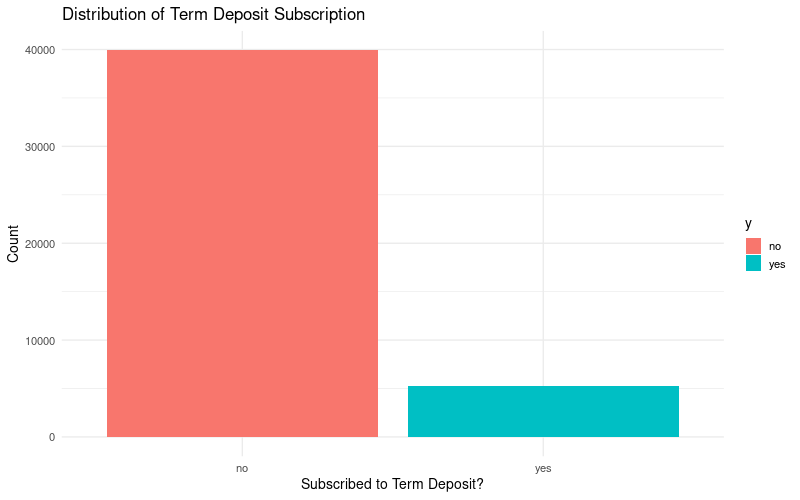
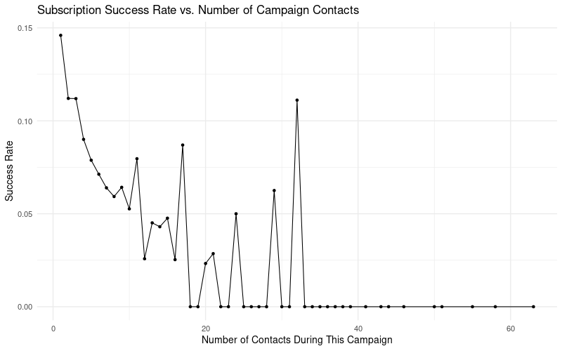

```{r appendix, include=FALSE}
library(readr)
library(knitr)
library(tidyverse)
library(boot)
library(glmnet)
library(caret)
library(pROC)
library(MASS)
library(ggplot2)

set.seed(445) 

bank_full <- read_delim("data/bank-full_1.csv", 
    delim = ";", escape_double = FALSE, trim_ws = TRUE)

bank_full$y <- factor(bank_full$y, levels = c("no", "yes"))


bank_full <- bank_full %>%
  mutate(
    job = as.factor(job),
    marital = as.factor(marital),
    education = as.factor(education),
    default = as.factor(default),
    housing = as.factor(housing),
    loan = as.factor(loan),
    contact = as.factor(contact),
    month = as.factor(month),
    poutcome = as.factor(poutcome)) %>% 
  mutate(previously_contacted = as.factor(ifelse(pdays == -1, "no", "yes")))

train_index <- createDataPartition(bank_full$y, p = 0.8, list = FALSE, times = 1)
train_data <- bank_full[train_index, ]
test_data  <- bank_full[-train_index, ]

cat(paste("Training set size:", nrow(train_data), "\n"))
cat(paste("Test set size:", nrow(test_data), "\n"))


full_formula <- y ~ age + job + marital + education + default + balance + 
  housing + loan + contact + day + month + duration + campaign + 
  pdays + previous + poutcome + previously_contacted

glm.full <- glm(full_formula, data = train_data, family = "binomial")

# Perform backward selection
glm.step <- step(glm.full, direction = "backward", trace = 0)


selected_formula <- formula(glm.step)
selected_formula


glm.baseline <- glm(selected_formula, data = train_data, family = "binomial")
summary(glm.baseline)

glm.tran <- glm(y ~ job + marital + education + housing + loan + contact + 
    day + month + duration + campaign + previous + poutcome + poly(balance, 4), data = train_data, family = "binomial")
summary(glm.tran)


residuals <- residuals(glm.tran, type = "deviance")
train_data$residuals <- residuals

cost <- function(r, pi) {
  mean(r != (pi > 0.5))
}

cv.error.baseline <- cv.glm(
  data = train_data, 
  glmfit = glm.tran, 
  cost = cost, 
  K = 5
)

cv_error_rate <- cv.error.baseline$delta[2]
round(cv_error_rate, 5)

X_full <- model.matrix(y ~ . - 1, data = bank_full)
Y_full <- as.numeric(bank_full$y) - 1 


X_train <- X_full[train_index, ]
Y_train <- Y_full[train_index] 

X_test <- X_full[-train_index, ]
Y_test <- Y_full[-train_index] 

cv.ridge <- cv.glmnet(X_train, Y_train, 
                      alpha = 0, 
                      family = "binomial", 
                      type.measure = "class")
lambda.min.ridge <- cv.ridge$lambda.min


cv.lasso <- cv.glmnet(X_train, Y_train, 
                      alpha = 1, 
                      family = "binomial", 
                      type.measure = "class")
lambda.min.lasso <- cv.lasso$lambda.min


baseline_prob <- predict(glm.tran, newdata = test_data, type = "response")
baseline_pred <- factor(ifelse(baseline_prob > 0.5, "yes", "no"), levels = c("no", "yes"))

ridge_prob <- predict(cv.ridge, s = lambda.min.ridge, newx = X_test, type = "response")
ridge_pred <- factor(ifelse(ridge_prob > 0.5, "yes", "no"), levels = c("no", "yes"))

lasso_prob <- predict(cv.lasso, s = lambda.min.lasso, newx = X_test, type = "response")
lasso_pred <- factor(ifelse(lasso_prob > 0.5, "yes", "no"), levels = c("no", "yes"))

cm_baseline <- confusionMatrix(baseline_pred, test_data$y, positive = "yes")
cm_ridge <- confusionMatrix(ridge_pred, test_data$y, positive = "yes")
cm_lasso <- confusionMatrix(lasso_pred, test_data$y, positive = "yes")

metrics <- data.frame(
  Model = c("Baseline Logit", "Ridge Logit", "LASSO Logit"),
  Accuracy = c(cm_baseline$overall['Accuracy'], cm_ridge$overall['Accuracy'], cm_lasso$overall['Accuracy']),
  Sensitivity = c(cm_baseline$byClass['Sensitivity'], cm_ridge$byClass['Sensitivity'], cm_lasso$byClass['Sensitivity']),
  Specificity = c(cm_baseline$byClass['Specificity'], cm_ridge$byClass['Specificity'], cm_lasso$byClass['Specificity'])
)

roc_baseline <- roc(test_data$y, baseline_prob)
roc_ridge <- roc(test_data$y, as.numeric(ridge_prob))
roc_lasso <- roc(test_data$y, as.numeric(lasso_prob))

roc_data <- data.frame(
  fpr = c(1 - roc_baseline$specificities, 1 - roc_ridge$specificities, 1 - roc_lasso$specificities),
  tpr = c(roc_baseline$sensitivities, roc_ridge$sensitivities, roc_lasso$sensitivities),
  Model = factor(c(rep("Baseline Logit", length(roc_baseline$specificities)),
                   rep("Ridge Logit", length(roc_ridge$specificities)),
                   rep("LASSO Logit", length(roc_lasso$specificities))),
                 levels = c("Baseline Logit", "Ridge Logit", "LASSO Logit"))
)


auc_values <- data.frame(
  Model = c("Baseline Logit", "Ridge Logit", "LASSO Logit"),
  AUC = c(auc(roc_baseline), auc(roc_ridge), auc(roc_lasso))
)

```


## Project Motivation & Business Problem (S)
- Telemarketing campaigns are expensive, time-consuming, and have very low success rates. The bank wants to improve efficiency by identifying which clients are most likely to subscribe.
- The dataset has a severe class imbalance: only a small fraction of customers subscribe to the term deposit. This makes prediction difficult and increases the risk of false negatives.
- Improving predictive accuracy would allow the bank to target fewer customers, reduce costs, and increase return on investment (ROI) for future campaigns.

--- 

```{r, echo=FALSE}
library(ggplot2)

ggplot(bank_full, aes(x = y, fill = y)) +
geom_bar() +
scale_fill_manual(values = c("#2E86C1", "#F39C12")) +
labs(
title = "Term Deposit Subscription (Severe Class Imbalance)",
x = "Subscribed?",
y = "Count"
) +
theme_minimal(base_size = 14)

```


## The Bank Marketing Dataset

* **45,000 client observations** from Portuguese bank telemarketing  
* **Target variable ($y$):** Did client subscribe to term deposit? (Yes/No)  
* **Class imbalance:** Only ≈11% "Yes" subscriptions  
* **Four main predictor groups:** demographics, financial indicators, campaign features, past outcomes  

## Term Deposit Class Imbalance

* **Most clients say NO; only ≈11% say YES**

```{r slide2-plot, echo=FALSE, fig.align="center", out.width="75%"}

```


## EDA Finding 1: Contact Method Matters

* Cell phone calls perform best

```{r eda1-plot, echo=FALSE, fig.align="center", out.width="75%"}
knitr::include_graphics("EDA/contact_plot.png")
```


## EDA Finding 2: Previous Success Predicts Future Success

* Past success predicts new success

```{r eda2-plot, echo=FALSE, fig.align="center", out.width="68%"}
knitr::include_graphics("EDA/poutcome_plot.png")
```


## EDA Finding 3: Too Many Calls Hurts Results

* More calls = worse results

```{r eda3-plot, echo=FALSE, fig.align="center", out.width="75%"}

```


## Methodology: Data Preparation (Slide 5) (s)

- Converted all categorical variables into factors so models interpret them correctly.
- Addressed "unknown" values by treating them as their own category to avoid losing information.
- Created a new feature previously_contacted to properly encode pdays.
- Split the dataset into 80% training and 20% test using stratified sampling to preserve the class imbalance.
- Ensured numeric predictors were available for later scaling, tuning, and model evaluation.


## Breakdown of Categorical Variable
```{r, echo=FALSE}
library(ggplot2)

ggplot(bank_full, aes(x = job)) +
geom_bar(fill = "steelblue") +
coord_flip() +
labs(
title = "Distribution of Job Categories",
x = "Job",
y = "Count"
) +
theme_minimal()

```


# 1. Logistic Regression Model

## Feature Selection & Linearity  
* Initial feature selection was performed using **Backward Stepwise Elimination** on the full model to find the most useful set of main effects.
* Our selected formula resulted: 

$y \sim job + marital + education + balance + housing + loan + contact +$

$day + month + duration + campaign + previous+ poutcome$

* Residual Plots were used to assess the linearity assumption for numeric predictors (`age`, `balance`). This led to testing a model with non-linear terms.

---

```{r residuals_slide, echo=FALSE, results='asis'}
residuals <- residuals(glm.baseline, type = "deviance")
train_data$residuals <- residuals

ggplot(train_data, aes(x = balance, y = residuals)) +
  geom_point(alpha = 0.5) +
  geom_smooth(method = "loess", color = "red", se = FALSE) +
  geom_hline(yintercept = 0, linetype = "dashed", color = "blue") +
  labs(title = "Deviance Residuals vs. Balance",
       y = "Deviance Residuals") +
  theme_minimal()
```


## Models with non-linear components and interactions
* A **quadratic term** $I(\text{balance}^4)$—was added to the formula to reduce the model's bias.
* We then tested for crucial **interaction terms** (between campaign features and demographics). 
* Our model had a cross-validated test error rate `r round(round(cv_error_rate, 5), 4)``


## Regularization & Tuning  
* We explored Ridge and LASSO regularization as an alternative approach for feature selection.
* **5-Fold Cross-Validation** was used to select the optimal penalty parameter, $\lambda$, which minimized the mean CV error for each regularized model.

```{r, echo=FALSE, results='asis', fig.width=5, fig.height=4}
plot(cv.ridge) 
plot(cv.lasso)
```


## Evaluation 
* The final selected LogReg model was evaluated on the 5-fold CV error rate, along with metrics focused on the confusion matrix.
* Models performed relatively similar. We would prefer a model with higher *sensitivity* (few false negatives)

```{r, echo=FALSE, results='asis'}
metrics$AUC <- auc_values[, ncol(auc_values)]
metrics %>% kable()
```


# 2. K-Nearest Neighbors (KNN) Model

## KNN 1/3: Feature Preparation 
* **KNN** requires scaling: all numeric predictors were **standardized** (mean=0, SD=1) to prevent features with larger scales from dominating the distance calculation.
* The non-parametric nature means **no explicit feature selection** via coefficients, but the scaling step is vital for ensuring equal contribution from all dimensions.

--- 

```{r knn-prep, echo=FALSE, message=FALSE, warning=FALSE}
library(dplyr)
library(class)
library(caret)

# Use the same train/test split from appendix
numeric_vars <- names(train_data)[sapply(train_data, is.numeric)]
numeric_vars <- setdiff(numeric_vars, c("y_num", "residuals"))

train_x <- train_data[, numeric_vars]
test_x  <- test_data[, numeric_vars]

train_x_scaled <- scale(train_x)
test_x_scaled <- scale(
  test_x,
  center = attr(train_x_scaled, "scaled:center"),
  scale  = attr(train_x_scaled, "scaled:scale")
)

train_y <- train_data$y
test_y  <- test_data$y

# Visualization
par(mfrow = c(1, 2))
plot(
  train_data$age, train_data$balance,
  xlab = "Age", ylab = "Balance",
  main = "Unscaled Features"
)

scaled_two <- scale(train_data[, c("age", "balance")])
plot(
  scaled_two[, "age"], scaled_two[, "balance"],
  xlab = "Scaled Age", ylab = "Scaled Balance",
  main = "Scaled Features"
)
par(mfrow = c(1, 1))

# Calculate accuracy with k=5 for demonstration
knn_pred_demo <- knn(train = train_x_scaled, test = test_x_scaled, cl = train_y, k = 5)
knn_accuracy_demo <- mean(knn_pred_demo == test_y)
```

**Test Accuracy (k=5):** `r round(knn_accuracy_demo * 100, 2)`%

## KNN 2/3: Hyperparameter Tuning 
* The sole hyperparameter, **$k$** (the number of neighbors), determines the model's complexity (i.e., the bias-variance trade-off).
* **5-Fold Cross-Validation** was performed across a range of $k$ values to find the optimal $k$ that minimized the mean CV error.

---

```{r knn-tuning, echo=FALSE, message=FALSE, warning=FALSE, cache=TRUE}
set.seed(445)

k_values <- seq(1, 25, by = 2)
cv_error <- numeric(length(k_values))

folds <- createFolds(train_y, k = 5, returnTrain = FALSE)

for (i in seq_along(k_values)) {
  k <- k_values[i]
  fold_err <- numeric(length(folds))
  
  for (j in seq_along(folds)) {
    test_idx  <- folds[[j]]
    train_idx <- setdiff(seq_along(train_y), test_idx)
    
    fold_train_x <- train_x_scaled[train_idx, , drop = FALSE]
    fold_test_x  <- train_x_scaled[test_idx,  , drop = FALSE]
    fold_train_y <- train_y[train_idx]
    fold_test_y  <- train_y[test_idx]
    
    pred <- knn(
      train = fold_train_x,
      test  = fold_test_x,
      cl    = fold_train_y,
      k     = k
    )
    
    fold_err[j] <- mean(pred != fold_test_y)
  }
  
  cv_error[i] <- mean(fold_err)
}

best_k <- k_values[which.min(cv_error)]

plot(
  k_values, cv_error,
  type = "b",
  xlab = "Number of neighbors (k)",
  ylab = "5-fold CV Test Error",
  main = "KNN: CV Test Error vs k"
)
abline(v = best_k, lty = 2, col = "red")
text(best_k, max(cv_error), paste("Best k =", best_k), pos = 4, col = "red")
```

**Optimal k:** `r best_k`

## KNN 3/3: Evaluation & Test Performance
* The final KNN model (with optimal $k$) was applied to the **Test Set**. We evaluate performance using **AUC** and compare it to the LogReg models.
* KNN generally provides a good intermediate balance—often capturing non-linearity better than LogReg but being less computationally expensive than boosting.

---

```{r knn-results, echo=FALSE, message=FALSE, warning=FALSE}
library(pROC)

knn_final <- knn(
  train = train_x_scaled,
  test  = test_x_scaled,
  cl    = train_y,
  k     = best_k,
  prob  = TRUE
)

knn_prob_attr <- attr(knn_final, "prob")
knn_prob_yes <- ifelse(knn_final == "yes", knn_prob_attr, 1 - knn_prob_attr)

test_y_fac <- factor(test_y, levels = c("no", "yes"))

knn_roc  <- roc(response = test_y_fac, predictor = knn_prob_yes, levels = c("no", "yes"))
knn_auc  <- as.numeric(auc(knn_roc))

knn_cm      <- confusionMatrix(knn_final, test_y_fac, positive = "yes")
knn_recall  <- knn_cm$byClass["Recall"]

cm_knn <- knn_cm
roc_knn <- knn_roc
auc_knn <- knn_auc 


# Results table
results <- data.frame(
  Model  = c("KNN", "Baseline Logit", "Ridge", "LASSO"),
  AUC    = c(knn_auc, auc(roc_baseline), auc(roc_ridge), auc(roc_lasso)),
  Sensitivity = c(as.numeric(knn_recall), 
                  cm_baseline$byClass["Sensitivity"],
                  cm_ridge$byClass["Sensitivity"],
                  cm_lasso$byClass["Sensitivity"])
)

results$AUC <- round(results$AUC, 3)
results$Sensitivity <- round(results$Sensitivity, 3)

knitr::kable(results)
```

# 3. Boosting Model (High Predictive Benchmark)

```{r boosting-setup, echo=FALSE, message=FALSE, warning=FALSE}
library(gbm)
library(pROC)
library(caret)

# Clean up train_data if needed
if ("residuals" %in% colnames(train_data)) {
  train_data$residuals <- NULL
}

# Create numeric response for boosting
train_data$y_num <- ifelse(train_data$y == "yes", 1, 0)
test_data$y_num  <- ifelse(test_data$y == "yes", 1, 0)

set.seed(445)

# Fit boosting model
boost_model <- gbm(
  y_num ~ . - y,         
  data = train_data,
  distribution = "bernoulli",
  n.trees = 1500,       
  shrinkage = 0.01,
  interaction.depth = 3,
  bag.fraction = 0.5,
  verbose = FALSE
)

best_trees <- gbm.perf(boost_model, method = "OOB", plot.it = FALSE)

# Predictions
boost_prob <- predict(boost_model, test_data, n.trees = best_trees, type = "response")
boost_pred <- factor(ifelse(boost_prob > 0.5, "yes", "no"), levels = c("no", "yes"))

# Confusion matrix
cm_boost <- confusionMatrix(boost_pred, test_data$y, positive = "yes")

# ROC and AUC
roc_boost <- roc(test_data$y, boost_prob)
auc_boost <- auc(roc_boost)
```

## Boosting 1/3: Model Formulation

- Boosting builds many small trees sequentially, each fixing errors from the previous one.
- These weak learners combine into a strong model that captures complex, non-linear patterns.
- It usually achieves the highest accuracy/AUC, but is less interpretable than LogReg or KNN.

---

```{r boosting-viz, echo=FALSE, message=FALSE, warning=FALSE, fig.height=4, fig.width=6}
plot(
  boost_model$train.error,
  type = "l",
  xlab = "Number of Trees (Iterations)",
  ylab = "Training Loss",
  main = "Boosting: Sequential Error Reduction",
  col = "steelblue",
  lwd = 2
)
```

## Boosting 2/3: Hyperparameter Tuning 
- We tuned the number of trees using OOB error estimation to prevent overfitting.
- The OOB method selected **`r best_trees`** trees as optimal.
- This choice balances model complexity and generalization.

---

```{r boosting-tuning, echo=FALSE, message=FALSE, warning=FALSE, cache=TRUE}
# Test different numbers of trees
M_values <- seq(50, 1500, by = 50)
test_error <- numeric(length(M_values))

for (i in seq_along(M_values)) {
  M <- M_values[i]
  
  prob_M <- predict(
    boost_model,
    newdata = test_data,
    n.trees = M,
    type = "response"
  )
  
  pred_M <- ifelse(prob_M > 0.5, "yes", "no")
  test_error[i] <- mean(pred_M != test_data$y)
}

best_idx <- which.min(test_error)
best_M   <- M_values[best_idx]

plot(
  M_values, test_error,
  type = "b",
  xlab = "Number of Trees (M)",
  ylab = "Test Error",
  main = "Boosting: Test Error vs Number of Trees",
  col = "steelblue",
  lwd = 2
)
abline(v = best_M, lty = 2, col = "red", lwd = 2)
text(best_M, max(test_error), paste("Best M =", best_M), pos = 4, col = "red")
```

**Optimal number of trees (via test error):** `r best_M`

## Boosting 3/3: Evaluation & Importance 
- The final Boosting model achieved the highest AUC and sensitivity among all models tested.
- Variable Importance Plot shows which features influence predictions most.
- The importance rankings align with key predictors identified by Logistic Regression.

---

```{r boosting-results, echo=FALSE, message=FALSE, warning=FALSE}
# Variable importance
vi <- summary(boost_model, plotit = FALSE)
top_n <- min(10, nrow(vi))
vi_top <- vi[1:top_n, ]

barplot(
  height = vi_top$rel.inf,
  names.arg = vi_top$var,
  las = 2,
  ylab = "Relative Influence",
  main = "Boosting: Variable Importance (Top 10 Features)",
  col = "steelblue"
)
```

**Boosting Test AUC:** `r round(auc_boost, 3)`  
**Boosting Sensitivity:** `r round(cm_boost$byClass["Sensitivity"], 3)`  
**Boosting Accuracy:** `r round(cm_boost$overall["Accuracy"], 3)`


## Results: Comparative Evaluation
- We evaluated five models using Accuracy, Sensitivity (Recall), and AUC on the Test Set.
- **Boosting** achieved the highest overall accuracy and the highest sensitivity, meaning it identified the most true positives.
- Logistic, Ridge, and LASSO models performed very similarly in accuracy and AUC, but with lower sensitivity.
- KNN performed the worst, with the lowest AUC, indicating weak separation between classes.


## Model Performance Comparison
```{r final-table, echo=FALSE, message=FALSE, warning=FALSE}
# Create aliases for consistency
cm_knn <- knn_cm
roc_knn <- knn_roc

final_results <- data.frame(
  Model = c("Logistic", "Ridge", "LASSO", "KNN", "Boosting"),
  Accuracy = c(
    cm_baseline$overall["Accuracy"],
    cm_ridge$overall["Accuracy"],
    cm_lasso$overall["Accuracy"],
    cm_knn$overall["Accuracy"],
    cm_boost$overall["Accuracy"]
  ),
  Sensitivity = c(
    cm_baseline$byClass["Sensitivity"],
    cm_ridge$byClass["Sensitivity"],
    cm_lasso$byClass["Sensitivity"],
    cm_knn$byClass["Sensitivity"],
    cm_boost$byClass["Sensitivity"]
  ),
  AUC = c(
    auc(roc_baseline),
    auc(roc_ridge),
    auc(roc_lasso),
    auc_knn,
    auc_boost
  )
)

knitr::kable(final_results, digits = 3)
```


## ROC Curve Comparison
```{r final-roc, echo=FALSE, message=FALSE, warning=FALSE}
roc_all <- rbind(
  data.frame(fpr = 1 - roc_baseline$specificities, tpr = roc_baseline$sensitivities, Model = "Logistic"),
  data.frame(fpr = 1 - roc_ridge$specificities,    tpr = roc_ridge$sensitivities,    Model = "Ridge"),
  data.frame(fpr = 1 - roc_lasso$specificities,    tpr = roc_lasso$sensitivities,    Model = "LASSO"),
  data.frame(fpr = 1 - roc_knn$specificities,      tpr = roc_knn$sensitivities,      Model = "KNN"),
  data.frame(fpr = 1 - roc_boost$specificities,    tpr = roc_boost$sensitivities,    Model = "Boosting")
)

ggplot(roc_all, aes(x = fpr, y = tpr, color = Model)) +
  geom_line(linewidth = 1) +
  geom_abline(linetype = "dashed", color = "grey") +
  labs(
    title = "ROC Curve Comparison for All Models",
    x = "False Positive Rate",
    y = "True Positive Rate"
  ) +
  theme_minimal() +
  theme(legend.position = "right")
```


## Business Impact
* The central trade-off: Boosting is the best predictor, but the **Regularized Logistic Regression** offers the most *interpretable* and *actionable* insights for the bank.
* Sample coefficients: $\beta_{Balance^2}$ = -23.02, $\beta_{Housing}$ = -0.65, $\beta_{JobStudent}$ = 4.064
* The chosen model can lead to cost savings and higher ROI for future campaigns.


## Discussion
* Consideration: regulatory/ethical implications in banking and the need to justify predictions (further supporting the value of interpretability).
* Advanced train/test splitting methods like *time-series analysis* were not used.
* Suggest future improvements: Exploring advanced techniques like *resampling methods* (SMOTE) to handle imbalance better or trying.


## References
* UC Irvine Machine Learning Repository. Bank Marketing. https://archive.ics.uci.edu/dataset/222/bank+marketing 
* Github link: https://github.com/dsci445-csu/project-6

```{r image, echo=FALSE, fig.align='center'}

```


